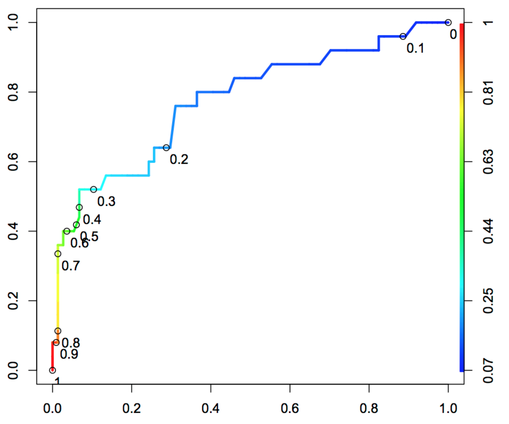

# Deep Learning in Practice

**ISAE-SUPAERO, SDD, Nov/Dev 2020**

Florient CHOUTEAU

<!--v-->

https://app.sli.do/event/s79n7gax/live/questions

<!--v-->

Slides : https://fchouteau.github.io/isae-practical-deep-learning/

Notebooks : https://github.com/fchouteau/isae-practical-deep-learning

<!--s-->

## Detect Aircrafts on Satellite Imagery

<!--v-->

6 hours hands on session on applying "deep learning" to a "real" use-case

 <!-- .element: height="40%" width="40%" -->

<!--v-->
<!-- .slide: data-background="http://i.giphy.com/90F8aUepslB84.gif" -->

### Lesson #1 <!-- .element: style="color: white; font-family: serif; font-size: 1.2em;" -->

These slides are built using <!-- .element: style="color: white; font-family: cursive; font-size: 1.2em;" --> [reveal.js](https://revealjs.com) and [reveal-md](
https://github.com/webpro/reveal-md)

This is awesome ! 😲 <!-- .element: style="color: white; font-family: cursive; font-size: 1.2em;" -->

<!--v-->

### Who ?

-  <!-- .element: height="44px" width="220px" -->
- Computer Vision R&D at Airbus Defence and Space
- Ground segment software for earth observation satellites
- Working daily with Deep Learning on satellite imagery
    - Information extraction
    - Image processing
    - Research stuff

<!--v-->

### Context: Earth Observation

  <!-- .element:  width="60%" height="60%"-->

<!--v-->

### Context: Machine Learning on Satellite Imagery

A lot of use cases (public):

- Land Use / Land Cover cartography
- Urban Cartography (building, roads, damage assessment...)
- Various objects detections (ships, vehicles..)

<!--v-->

### Context: Needles in haystacks

  <!-- .element:  width="40%" height="40%"-->

<!--v-->

### What you did last time 

- Trained a Convolutional Neural Network on Fashion MNIST
- Wrote your first training loops with Pytorch
- Discovered callbacks (early stopping), optimizers (sgd, adam), dropout
- Saw your firsts neural architectures (alexnet, vggs, resnets)
- Maybe discovered pytorch ignite

<!--v-->

### What we are going to do

Train an aircraft detector on a dataset of aircrafts and "not aircrafts"

- using convolutional neural networks <!-- .element: class="fragment" data-fragment-index="1" -->
- using pytorch <!-- .element: class="fragment" data-fragment-index="2" -->
- using google colaboratory and its GPUs <!-- .element: class="fragment" data-fragment-index="3" -->

 <!-- .element:  width="25%" height="25%"-->

<!--s-->

## Session 1: Hands-On

<!--v-->

### Objectives

- Launch notebooks on Colab
- Discover pytorch-ignite
- Train a basic CNN on a small training set
- Plot the metrics & ROC curve on a small test set

<!--v-->

### Outcomes

- Use GCP to get access to computing power & GPUs
- Handle a dataset of images, do some basic data exploration
- Discover *pytorch-ignite* a high-level deep-learning framework for pytorch
- Train & evaluate your first CNN on a simple dataset

<!--v-->

###  <!-- .element:  width="15%" height="15%"-->

- [pytorch-ignite](https://github.com/skorch-dev/skorch) : a high-level deep learning library based on top of pytorch
- Reduce boilerplate code (training loops, early stopping, logging...)
- Extensible, based on experiment management

<!--v-->

### Pytorch Ecosystem 

- There are other high-level frameworks based on pytorch: [Skorch](https://github.com/skorch-dev/skorch), [Lightning](https://github.com/williamFalcon/pytorch-lightning). All of them have their pros and cons
- [There is a huge ecosystem based around pytorch](https://pytorch.org/ecosystem/)

 <!-- .element: style="width: 25%; height: 25%"--> 

<!--v-->

### Dataset description

- 2600 train images (1300 aircrafts, 1300 background), size 64x64
- 880 test images (440 aircrafts, 440 background), size 64x64

 <!-- .element height="40%" width="40%" -->

<!--v-->

### Let's go ! 

1. Go to google colab
2. Import the first notebook & follow it
3. At the end, you will be less guided
4. Profit !
5. If you're done... go to Session 2 !

<!--s-->

## Session 2
## Class Imbalance & Sliding Windows

<!--v-->

https://app.sli.do/event/s79n7gax/live/questions

<!--v-->

### Objectives

- Train a CNN on a larger & imbalanced dataset
- Evaluate the performance of a model on imbalanced data
- Try and improve performance
- Apply your model on larger images to detect aircrafts

<!--v-->

### Trainval Dataset description

- 46000 64x64 train images
- 10240 64x64 test images
- **1/10 aircraft-background ratio**

 <!-- .element height="35%" width="35%" -->

<!--v-->

### Test Dataset description

- 36 512x512 images with some aircrafts

 <!-- .element height="35%" width="35%" -->

<!--v-->

### Sliding window ?

- Training Image Size: 64x64, output = binary classification
- Target Image Size: 512x512, target = detect & count aircrafts ?

<!--v-->

### Outcomes

- Tackle a dataset with huge class imbalance
- Discover more advanced techniques for training CNNs
- Discover Precision-Recall Curves
- Discover applying models on larger images using the sliding window technique

<!--v-->

### Steps by steps

1. Start/Restart your machine
2. Follow notebooks 2 and 3

<!--s-->

## Diagnosing Classifier performance

<!--v-->

### The Confusion Matrix

<!--v-->

### F-Beta ?

 <!-- .element height="35%" width="35%" -->

- beta > 1 => Emphasizes recall
- beta < 1 => Emphasizes precision

<!--v-->

### The ROC Curve

<!--v-->

### The ROC curve (visualized)

The shape of an ROC curve changes when a model changes the way it classifies the two outcomes.

<!--v-->

### The PR Curve

 <!-- .element height="35%" width="35%" -->

<!--v-->

### The PR Curve (visualized)

 The shape of the precision-recall curve also changes when a model changes the way it classifies the two outcomes.
 
<!--v-->

### Using any curve to select your trade-off

  <!-- .element height="40%" width="40%" -->

(this is a roc curve)

<!--v-->

### Using any curve to select your trade-off

  <!-- .element height="40%" width="40%" -->

(this is a roc curve)

<!--v-->

### Precision-Recall or ROC ?

- Plotting Interpretability: Imbalanced Dataset vs ROC Curve ?
- Both curve can be used to select your trade-off
- Precision-recall curve is more sensitive to class imbalanace than an ROC curve

  <!-- .element height="50%" width="50%" -->

<!--v-->

Readings:
- https://lukeoakdenrayner.wordpress.com/2018/01/07/the-philosophical-argument-for-using-roc-curves/
- https://towardsdatascience.com/on-roc-and-precision-recall-curves-c23e9b63820c

<!--s-->

## Concluding remarks

<!--v-->

Welcome to the life of a deep learning engineer !

<!--v-->

<!--v-->

Contact (add at airbus dot com):

florient.f.chouteau
matthieu.le-goff
marina.gruet

<!--v-->

