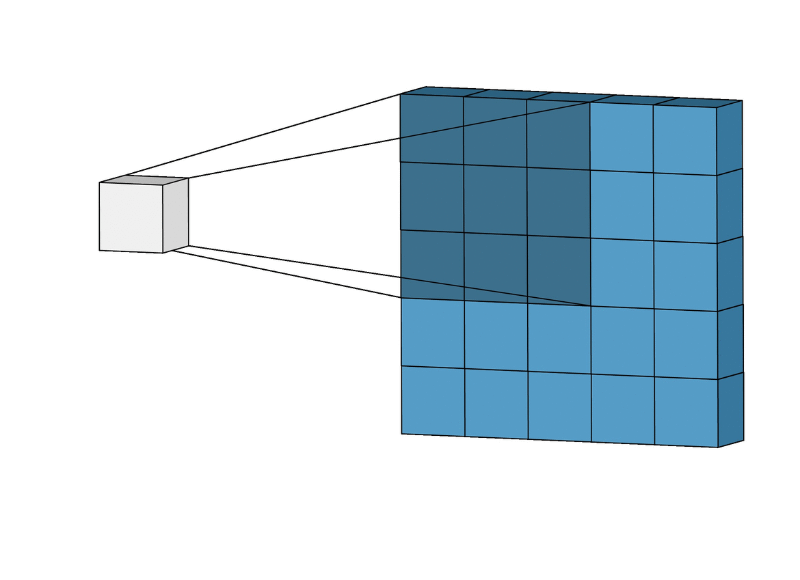

# Deep Learning in Practice

**ISAE-SUPAERO, SDD, 25 Nov. 2024**

Florient CHOUTEAU, Hedwin BONNAVAUD

<!--v-->

Slides : https://fchouteau.github.io/isae-practical-deep-learning/

Notebooks : https://github.com/SupaeroDataScience/deep-learning/tree/main/vision

<!--s-->

## Detect Aircrafts on Satellite Imagery


<!--v-->

6 hours hands on session on applying "deep learning" to a "real" use-case

 <!-- .element: height="40%" width="40%" -->

<!--v-->
<!-- .slide: data-background="http://i.giphy.com/90F8aUepslB84.gif" -->

### RevealJS <!-- .element: style="color: white; font-family: serif; font-size: 1.2em;" -->

These slides are built using <!-- .element: style="color: white; font-family: cursive; font-size: 1.2em;" --> [reveal.js](https://revealjs.com) and [reveal-md](
https://github.com/webpro/reveal-md)

This is awesome ! 😲 <!-- .element: style="color: white; font-family: cursive; font-size: 1.2em;" -->

<!--v-->

### Who ?


- **Florient CHOUTEAU**, SDD 2016
- Expert (Staff Engineer) in Artificial Intelligence for Space Systems at **Airbus Defence and Space**
- Computer Vision Team (Earth Observation, Space Exploration, Space Domain Awareness)
- Specialized in Satellite Imagery Processing & Deep Learning
- Daily job revolving around Machine Learning + Satellite Imagery
    - Information extraction
    - Image processing
    - Research stuff

Any question ? contact me on slack !

<!--v-->

### Context: Earth Observation

  <!-- .element:  width="60%" height="60%"-->

<!--v-->

### Context: DL on Satellite Imagery

A lot of use cases :

- Land Use / Land Cover cartography
- Urban Cartography (building, roads, damage assessment...)
- Various objects detections (ships, vehicles...)

 <!-- .element:  width="60%" height="60%"-->

<!--v-->

### Context: DL on Satellite Imagery

Can also be used for "image processing" : 

- Denoising
- Super Resolution

 <!-- .element:  width="20%" height="20%"-->

<!--v-->

### Context: Needles in haystacks

  <!-- .element:  width="40%" height="40%"-->

<!--v-->

### What you did last time 

- Trained an ANN & a Convolutional Neural Network on Fashion MNIST
- Wrote your first training loops with Pytorch
- Maybe discovered "callbacks" (early stopping), optimizers (sgd, adam), dropout
- Maybe saw your firsts neural architectures (alexnet, vggs, resnets)
- Maybe discovered pytorch ignite

<!--v-->

### What we are going to do

Train an aircraft detector on a dataset of aircrafts and "not aircrafts"

- using convolutional neural networks <!-- .element: class="fragment" data-fragment-index="1" -->
- using pytorch <!-- .element: class="fragment" data-fragment-index="2" -->
- using google colaboratory and its GPUs <!-- .element: class="fragment" data-fragment-index="3" -->

 <!-- .element:  class="fragment" data-fragment-index="4" width="25%" height="25%"-->

<!--v-->

This is a "hands-on", not a full class

**More resources on DL for Computer Vision**

- [http://cs231n.stanford.edu](http://cs231n.stanford.edu/schedule.html)
- [https://d2l.ai/index.html](https://d2l.ai/index.html)


<!--s-->

## Session 1: Hands-On

<!--v-->

### Objectives

- Launch notebooks on Colab
- Build an intuition over convolutions and CNNs
- Train a basic CNN on a small training set
- Plot the metrics & ROC curve on a small test set
- Discover the world of hyperparameter tuning

<!--v-->

### Outcomes

- Build an intuition over convolutions and CNNs for image processing
- Handle a dataset of images, do some basic data exploration
- Train & evaluate your first CNN on a simple dataset
- Go beyound accuracy to diagnose your model

<!--v-->

### Dataset description

- 2600 train images (1300 aircrafts, 1300 background), size 64x64
- 880 test images (440 aircrafts, 440 background), size 64x64

 <!-- .element height="40%" width="40%" -->

<!--v--> 

### Pytorch reminder

  <!-- .element height="50%" width="50%" -->

<!--v-->

### Pytorch reminder

  <!-- .element height="50%" width="50%" -->


<!--v-->

### Let's go ! 

1. Go to google colab
2. Import the first notebook & follow the guidelines
3. ...
4. Profit !
5. If you're done... go to the next notebook !

<!--v-->

### Colab Guide

<video data-autoplay  controls width="720">
    <source src="https://storage.googleapis.com/fchouteau-isae-deep-learning/static/colab_guide_proper.mp4" type="video/mp4">
</video>

<!--v-->

### GPU ???

You'll see that... in February

[Tutorial](http://d2l.ai/chapter_appendix-tools-for-deep-learning/colab.html)

<!--s-->

## Session 1
## Take-Away messages

<!--v-->

### Kernel filtering

 <!-- .element height="30%" width="30%" -->

<!--v-->

### ConvNets intuition comes from image processing

 <!-- .element height="60%" width="60%" -->

(I apologize for using Lena as an example)

<!--v-->

### ConvNets intuition comes from image processing

 <!-- .element height="60%" width="40%" -->

<!--v-->

**ConvNets works because we assume inputs are images**

 <!-- .element height="60%" width="60%" -->

<!--v-->

### ConvNets

  <!-- .element height="60%" width="60%" -->

<!--v-->

### Convolutions ?

  <!-- .element height="40%" width="40%" -->

[useful link](https://github.com/vdumoulin/conv_arithmetic)

<!--v-->

### Pooling ?

 <!-- .element height="40%" width="40%" -->

<!--v-->

### nn.Linear ?

 <!-- .element height="40%" width="40%" -->

<!--v-->

### Computing shape

 <!-- .element height="35%" width="35%" -->

<!--v-->

### CNNs in practice...

 <!-- .element height="35%" width="35%" -->

```text
ResNet(
  (conv1): Conv2d(3, 64, kernel_size=(7, 7), stride=(2, 2), padding=(3, 3), bias=False)
  (bn1): BatchNorm2d(64, eps=1e-05, momentum=0.1, affine=True, track_running_stats=True)
  (relu): ReLU(inplace=True)
  (maxpool): MaxPool2d(kernel_size=3, stride=2, padding=1, dilation=1, ceil_mode=False)
  (layer1): Sequential(
    (0): BasicBlock(
      (conv1): Conv2d(64, 64, kernel_size=(3, 3), stride=(1, 1), padding=(1, 1), bias=False)
      (bn1): BatchNorm2d(64, eps=1e-05, momentum=0.1, affine=True, track_running_stats=True)
      (relu): ReLU(inplace=True)
      (conv2): Conv2d(64, 64, kernel_size=(3, 3), stride=(1, 1), padding=(1, 1), bias=False)
      (bn2): BatchNorm2d(64, eps=1e-05, momentum=0.1, affine=True, track_running_stats=True)
    )
    (1): BasicBlock(
      (conv1): Conv2d(64, 64, kernel_size=(3, 3), stride=(1, 1), padding=(1, 1), bias=False)
      (bn1): BatchNorm2d(64, eps=1e-05, momentum=0.1, affine=True, track_running_stats=True)
      (relu): ReLU(inplace=True)
      (conv2): Conv2d(64, 64, kernel_size=(3, 3), stride=(1, 1), padding=(1, 1), bias=False)
      (bn2): BatchNorm2d(64, eps=1e-05, momentum=0.1, affine=True, track_running_stats=True)
    )
  )
  (layer2): Sequential(
    (0): BasicBlock(
      (conv1): Conv2d(64, 128, kernel_size=(3, 3), stride=(2, 2), padding=(1, 1), bias=False)
      (bn1): BatchNorm2d(128, eps=1e-05, momentum=0.1, affine=True, track_running_stats=True)
      (relu): ReLU(inplace=True)
      (conv2): Conv2d(128, 128, kernel_size=(3, 3), stride=(1, 1), padding=(1, 1), bias=False)
      (bn2): BatchNorm2d(128, eps=1e-05, momentum=0.1, affine=True, track_running_stats=True)
      (downsample): Sequential(
        (0): Conv2d(64, 128, kernel_size=(1, 1), stride=(2, 2), bias=False)
        (1): BatchNorm2d(128, eps=1e-05, momentum=0.1, affine=True, track_running_stats=True)
      )
    )
    (1): BasicBlock(
      (conv1): Conv2d(128, 128, kernel_size=(3, 3), stride=(1, 1), padding=(1, 1), bias=False)
      (bn1): BatchNorm2d(128, eps=1e-05, momentum=0.1, affine=True, track_running_stats=True)
      (relu): ReLU(inplace=True)
      (conv2): Conv2d(128, 128, kernel_size=(3, 3), stride=(1, 1), padding=(1, 1), bias=False)
      (bn2): BatchNorm2d(128, eps=1e-05, momentum=0.1, affine=True, track_running_stats=True)
    )
  )
  (layer3): Sequential(
    (0): BasicBlock(
      (conv1): Conv2d(128, 256, kernel_size=(3, 3), stride=(2, 2), padding=(1, 1), bias=False)
      (bn1): BatchNorm2d(256, eps=1e-05, momentum=0.1, affine=True, track_running_stats=True)
      (relu): ReLU(inplace=True)
      (conv2): Conv2d(256, 256, kernel_size=(3, 3), stride=(1, 1), padding=(1, 1), bias=False)
      (bn2): BatchNorm2d(256, eps=1e-05, momentum=0.1, affine=True, track_running_stats=True)
      (downsample): Sequential(
        (0): Conv2d(128, 256, kernel_size=(1, 1), stride=(2, 2), bias=False)
        (1): BatchNorm2d(256, eps=1e-05, momentum=0.1, affine=True, track_running_stats=True)
      )
    )
    (1): BasicBlock(
      (conv1): Conv2d(256, 256, kernel_size=(3, 3), stride=(1, 1), padding=(1, 1), bias=False)
      (bn1): BatchNorm2d(256, eps=1e-05, momentum=0.1, affine=True, track_running_stats=True)
      (relu): ReLU(inplace=True)
      (conv2): Conv2d(256, 256, kernel_size=(3, 3), stride=(1, 1), padding=(1, 1), bias=False)
      (bn2): BatchNorm2d(256, eps=1e-05, momentum=0.1, affine=True, track_running_stats=True)
    )
  )
  (layer4): Sequential(
    (0): BasicBlock(
      (conv1): Conv2d(256, 512, kernel_size=(3, 3), stride=(2, 2), padding=(1, 1), bias=False)
      (bn1): BatchNorm2d(512, eps=1e-05, momentum=0.1, affine=True, track_running_stats=True)
      (relu): ReLU(inplace=True)
      (conv2): Conv2d(512, 512, kernel_size=(3, 3), stride=(1, 1), padding=(1, 1), bias=False)
      (bn2): BatchNorm2d(512, eps=1e-05, momentum=0.1, affine=True, track_running_stats=True)
      (downsample): Sequential(
        (0): Conv2d(256, 512, kernel_size=(1, 1), stride=(2, 2), bias=False)
        (1): BatchNorm2d(512, eps=1e-05, momentum=0.1, affine=True, track_running_stats=True)
      )
    )
    (1): BasicBlock(
      (conv1): Conv2d(512, 512, kernel_size=(3, 3), stride=(1, 1), padding=(1, 1), bias=False)
      (bn1): BatchNorm2d(512, eps=1e-05, momentum=0.1, affine=True, track_running_stats=True)
      (relu): ReLU(inplace=True)
      (conv2): Conv2d(512, 512, kernel_size=(3, 3), stride=(1, 1), padding=(1, 1), bias=False)
      (bn2): BatchNorm2d(512, eps=1e-05, momentum=0.1, affine=True, track_running_stats=True)
    )
  )
  (avgpool): AdaptiveAvgPool2d(output_size=(1, 1))
  (fc): Linear(in_features=512, out_features=2, bias=True)
)
```

<!--v-->

### ROC-Curves

(see section "extra" on these slides)

<!--s-->

## Session 2
## More complex example

<!--v-->

### Objectives

- **A first take at applied Deep Learning, using pytorch, CNNs and what we previously learned**
- Train a CNN on a larger & imbalanced dataset
- Evaluate the performance of a model on imbalanced data
- Try and improve performance
- Apply your model on larger images to detect aircrafts

<!--v-->

### Trainval Dataset description

- 91000 64x64 train images
- 20480 64x64 test images
- **1/20 aircraft-background ratio**

 <!-- .element height="35%" width="35%" -->

<!--v-->

### Final Dataset description

- Objective: Apply your classifier on "real" images and find aircrafts
- 43 512x512 images with some aircrafts

 <!-- .element height="35%" width="35%" -->

<!--v-->

### One idea: Sliding window

- Training Image Size: 64x64, output = binary classification
- Target Image Size: 512x512, target = detect & count aircrafts ?


<!--v-->

### Outcomes

- Tackle a dataset with huge class imbalance
- Discover more advanced techniques for training CNNs
- Discover Precision-Recall Curves
- Discover applying models on larger images using the sliding window technique

<!--v-->

### Steps by steps

1. Start/Restart your machine
2. Follow notebooks 2 and 3


<!--s-->

## Session 2: Take-home messages

<!--v-->

### Objectives

- Continue manipulating CNNs using pytorch
- Tackle a more realistic dataset
- Examine what must changes to diagnose your model and improve it

<!--v-->

### At home

- Continue the notebooks
- Ask question on chat
- Look at the Deep Learning classes of [cs231n](http://cs231n.stanford.edu/schedule.html)

<!--v-->

Welcome to the life of a deep learning engineer !


<!--v-->

 <!-- .element height="70%" width="70%" -->

<!--v-->


<!--s-->

## Extra
## Diagnosing Classifier performance

<!--v-->

### Binary classification metrics


<!--v-->

### The ROC Curve


<!--v-->

### The ROC curve (visualized)


The shape of an ROC curve changes when a model changes the way it classifies the two outcomes.

<!--v-->

### How to compute a ROC curve ?

  <!-- .element height="40%" width="40%" -->

- y_pred = a list of probas, y_true = a list of 0 or 1
- vertical line : threshold value
- red dot : FPR and TPR for the threshold
- the curve is plotted for all available thresholds

<!--v-->

### Precision & Recall

Usually the most important things in imbalanced classification

  <!-- .element height="40%" width="40%" -->

<!--v-->

### PR synthetic metric

 <!-- .element height="35%" width="35%" -->

- beta = 1 => Recall & Precision weighted equally
- beta > 1 => Emphasizes recall (not missing positive examples)
- beta < 1 => Emphasizes precision (not doing )

<!--v-->

### The PR Curve

 <!-- .element height="75%" width="75%" -->

<!--v-->

### The PR Curve (visualized)


The shape of the precision-recall curve also changes when a model changes the way it classifies the two outcomes.

<!--v-->

### Precision-Recall or ROC ?

- Both curve can be used to select your trade-off
- Precision-recall curve is more sensitive to class imbalance than an ROC curve
- Example: Try computing your FPR on very imbalanced dataset

  <!-- .element height="50%" width="50%" -->

<!--v-->

### Curves Usage: Selecting trade-off

  <!-- .element height="70%" width="70%" -->

<!--v-->

Readings:
- https://lukeoakdenrayner.wordpress.com/2018/01/07/the-philosophical-argument-for-using-roc-curves/
- https://towardsdatascience.com/on-roc-and-precision-recall-curves-c23e9b63820c

<!--s-->

## Extra : Pytorch Ecosystem

<!--v-->

### high-level frameworks over pytorch

- pytorch: define your models, autodifferenciation, **but you write the rest**
- hl library: training loops, callbacks, distribution etc...

  <!-- .element height="50%" width="50%" -->

<!--v-->

### high-level frameworks over pytorch

 <!-- .element height="40%" width="40%" -->

<!--v-->

###  <!-- .element:  width="15%" height="15%"-->

- [pytorch-ignite](https://github.com/skorch-dev/skorch) : a high-level deep learning library based on top of pytorch
- Reduce boilerplate code (training loops, early stopping, logging...)
- Extensible, based on experiment management

<!--v-->

### Pytorch Ecosystem 

- There are other high-level frameworks based on pytorch: [Skorch](https://github.com/skorch-dev/skorch), [Lightning](https://github.com/williamFalcon/pytorch-lightning). 
- All of them have their pros and cons
- [There is a huge ecosystem based around pytorch](https://pytorch.org/ecosystem/)

 <!-- .element: style="width: 25%; height: 25%"--> 

<!--s-->

### Extra : From classification to Detection and other use of CNNs for Vision

<!--v-->

We've done image classification that we applied in a sliding window fashion on larger images


<!--v-->

We can solve other types of tasks with ConvNets

  <!-- .element: style="width: 60%; height: 40%"--> 

<!--v-->

Image Segmentation

   <!-- .element: style="width: 60%; height: 40%"-->

<!--v-->

Object Detection (intuition)

  <!-- .element: style="width: 60%; height: 40%"-->

<!--v-->

Object Detection (in practice)

   <!-- .element: style="width: 60%; height: 40%"-->

<!--v-->

Instance Segmentation

  <!-- .element: style="width: 60%; height: 40%"-->


<!--v-->

To learn more about this, see [this cs231n class](http://cs231n.stanford.edu/slides/2022/lecture_9_jiajun.pdf)

<!--v-->

Keypoint Detection

  <!-- .element: style="width: 60%; height: 40%"-->

<!--v-->

Image Restoration


<!--v-->

Other keywords that are important for CNN in Computer Vision

- [Self-Supervised Learning](http://cs231n.stanford.edu/slides/2023/lecture_13.pdf)
- [Vision Transformers](https://www.v7labs.com/blog/vision-transformer-guide)
- [Generative Adversarial Networks](https://github.com/SupaeroDataScience/deep-learning/tree/main/GAN)
- [Diffusion Models](http://cs231n.stanford.edu/slides/2023/lecture_15.pdf) (StableDiffusion, MidJourney ...)

<!--s-->

## Extra : From CNN to Transformers

<!--v-->


<!--v-->


[An Image is Worth 16x16 Words](https://arxiv.org/abs/2010.11929)

<!--v-->

  <!-- .element: style="width: 60%; height: 40%"-->

<!--v-->

https://cs231n.stanford.edu/slides/2024/lecture_8.pdf

<!--v-->

[example use case](https://www.picsellia.com/post/are-transformers-replacing-cnns-in-object-detection)

<!--s-->

## Extra : AI for CV, in practice

[ISAE SPAPS 2023-2024 class](https://docs.google.com/presentation/d/10zd65eg0X_aqydggKRvC3s20AXSu3WI9RWWUKJVvfAI/edit?usp=sharing)
