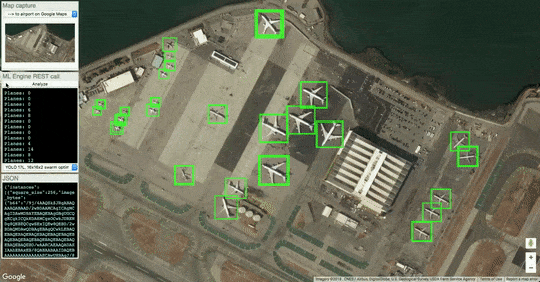
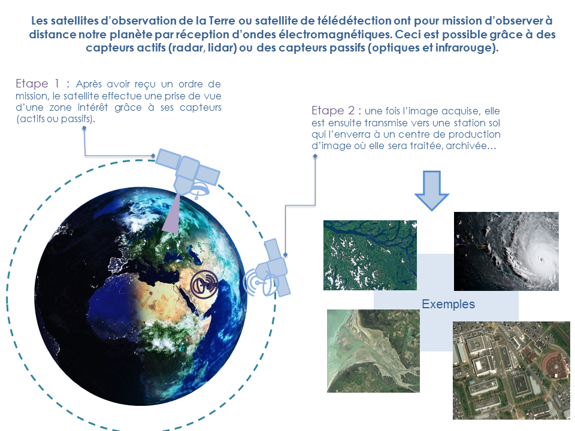
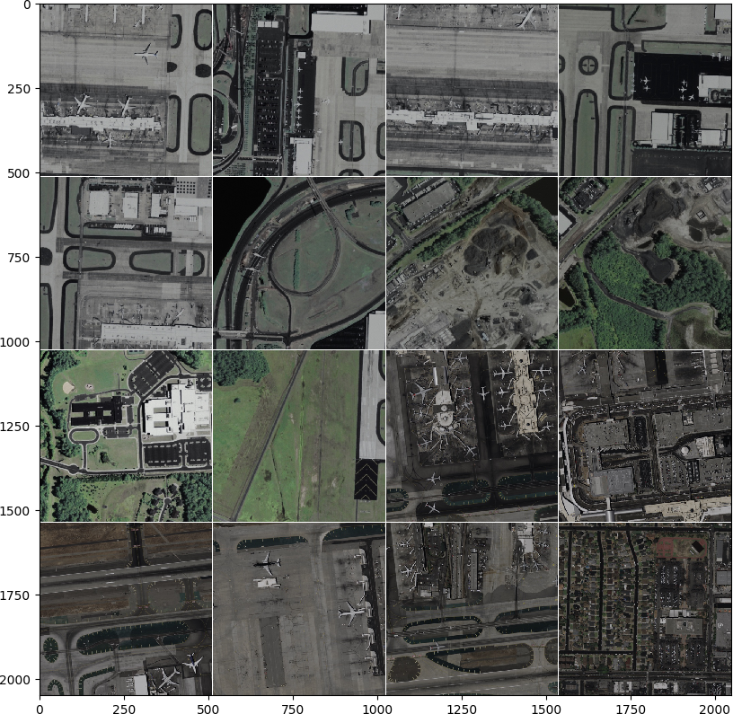

# Deep Learning in Practice

**ISAE-SUPAERO, SDD, December 2019**

Florient CHOUTEAU, Marina GRUET, Matthieu LE GOFF

<!--v-->

Slides : https://fchouteau.github.io/isae-practical-deep-learning/

Notebooks : https://github.com/fchouteau/isae-practical-deep-learning

<!--s-->

## Detect Aircrafts on Satellite Imagery

<!--v-->

6 hours hands on session on applying "deep learning" to a "real" use-case

<!--v-->
<!-- .slide: data-background="http://i.giphy.com/90F8aUepslB84.gif" -->

### Lesson #1

These slides are built using [reveal.js](https://revealjs.com) and [reveal-md](
https://github.com/webpro/reveal-md)

This is awesome ! Stop using powerpoint !

<!--v-->

### Who we are

- Computer Vision R&D at Airbus Defence and Space

- Ground segment software for earth observation satellites
- Working daily with Deep Learning on satellite imagery
    - Information extraction (object detection, change detection...)
    - Image processing (clouds, image enhancement)
    - Research stuff (image simulation, self-supervision...)
 
**BTW.... We have internships !** <!-- .element: class="fragment" data-fragment-index="1" -->

<!--v-->

### Context: Earth Observation

  <!-- .element:  width="80%" height="80%" style="background:white; border:none; box-shadow:none;"-->

<!--v-->

### Objects in Satellite Imagery

  <!-- .element:  width="55%" height="55%" style="background:white; border:none; box-shadow:none;"-->

<!--v-->

### What we are going to do

Train an aircraft detector on a dataset of aircrafts and "not aircrafts"

- using convolutional neural networks <!-- .element: class="fragment" data-fragment-index="1" -->
- using pytorch <!-- .element: class="fragment" data-fragment-index="2" -->
- using a Virtual Machine w/ GPU on Google Cloud Platform <!-- .element: class="fragment" data-fragment-index="3" -->

 <!-- .element: class="fragment" data-fragment-index="3"  width="170px" height="150px" style="background:white; border:none; box-shadow:none;" -->

<!--s-->

## Session 1: Hands-On

<!--v-->

### Objectives

- Setup your work environment on GCP
- Train a basic CNN on a small training set
- Plot the ROC curve on a small test set

<!--v-->

### Outcomes

- Use GCP to get access to computing power & GPUs
- Handle a dataset of images, do some basic data exploration
- Discover *skorch* a high-level deep-learning framework for pytorch
- Train & evaluate your first CNN on a simple dataset

<!--v-->

### Dataset description

- 2250 train images (1125 aircrafts, 1125 background), 64x64
- 750 test images (375 aircrafts, 375 background), 64x64

 <!-- .element height="40%" width="40%" -->

<!--v-->

### Remember GCP class ? Use either...

- Google Colaboratory
- Jupyter AI Notebook (use custom instance + gpu, pytorch 1.2 & jupyter lab)

<!--v-->

### Steps by steps

1. Create your AI Notebook / Google Colab
2. Connect to jupyterlab
3. Import the first notebook & follow it
4. Profit !
5. If you're done... go to Session 2 !

<!--s-->

## Session 2: Class Imbalance & Sliding Windows

<!--v-->

### Objectives

- Train a CNN on a larger & imbalanced dataset
- Evaluate the performance of a model on imbalanced data
- Try and improve performance
- Apply your model on larger images to detect aircrafts

<!--v-->

### Trainval Dataset description

- 40000 64x64 train images
- 15000 64x64 test images
- **1/10 aircraft-background ratio**

 <!-- .element height="40%" width="40%" -->

<!--v-->

### Test Dataset description

- 30 512x512 images with some aircrafts

 <!-- .element height="40%" width="40%" -->

<!--v-->

### Sliding window ?

- Training Image Size: 64x64, output = binary classification
- Target Image Size: 512x512, target = detect & count aircrafts ?

<!--v-->

### Outcomes

- Tackle a dataset with huge class imbalance
- Discover more advanced techniques for training CNNs
- Discover Precision-Recall Curves
- Discover applying models on larger images using the sliding window technique

<!--v-->

### Steps by steps

1. Start/Restart your machine
2. Follow notebooks 2 and 3

<!--s-->

## Concluding remarks

<!--v-->

Welcome to the life of a deep learning engineer !

<!--v-->

<!--v-->

Contact:  

florient.f.chouteau@airbus.com  
matthieu.le-goff@airbus.com  
marina.gruet@airbus.com  

<!--v-->

